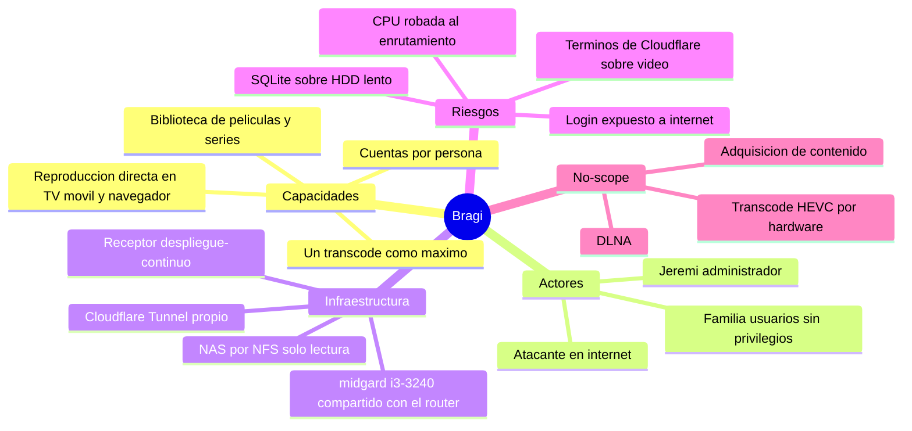

# Project Charter — Bragi, servidor de medios doméstico

* **Estado:** approved (Gate 0, 2026-09-17)
* **Fecha:** 2026-09-17
* **Decisores:** Jeremi
* **Fase AI-DLC:** 00-project
* **Versión:** 0.1.0
* **Sponsor:** Jeremi
* **Owner del proyecto:** Jeremi

## Visión
Servir la biblioteca de películas y series del hogar (2,2 TB en el NAS) a los televisores,
móviles y navegadores de la familia, dentro y fuera de casa, con Jellyfin sobre el appliance
de red existente (midgard), **sin que el streaming degrade el enrutamiento de la casa**.

Bragi es el dios nórdico de la poesía, el bardo de Valhalla: el que cuenta las historias.
Sigue la convención de nombres de [Yggdrasil](https://github.com/higerotech/yggdrasil)
(`docs/00-project/naming.md`) y, como Fenrir, vive en su propio repositorio por tener
presupuesto de recursos y ciclo de vida propios.

## Alcance
- Incluye:
  - Jellyfin 10.11.11 en Docker sobre midgard (Ubuntu 24.04, i3-3240 2C/4T, 7,6 GB RAM,
    HDD 5400 rpm), con **topes explícitos de CPU y memoria** (ADR-0002).
  - Biblioteca en el NAS por NFS v3, montada **solo lectura** (ADR-0005).
  - Cuentas por persona: un administrador y cuentas sin privilegios para la familia.
  - Acceso en la LAN por la IP del appliance y acceso externo por un **Cloudflare Tunnel
    propio** (ADR-0004, pendiente de decisión HITL).
  - Despliegue continuo con el receptor de `higerotech/despliegue-continuo` (ADR-0003).
- **No incluye (no-scope):**
  - Adquisición de contenido. Transmission ya corre en midgard y queda fuera: Bragi solo lee
    la biblioteca.
  - Más de **un** transcode simultáneo: el i3-3240 no llega (1,42x sin tope). El diseño
    empuja a reproducción directa.
  - Aceleración por hardware para HEVC: la iGPU HD 2500 (Gen7) no decodifica HEVC.
  - Descubrimiento automático DLNA/SSDP (exigiría `network_mode: host`).
  - Plugins de terceros y Live TV/DVR.
  - Observabilidad en Heimdall (métricas y alertas): candidata a Gate 5, vía Yggdrasil.

## Mapa mental del alcance

## Stakeholders
| Rol | Persona | Interés |
|---|---|---|
| Sponsor / Owner / Admin | Jeremi | Servicio estable que no rompa la red de la casa |
| Usuarios | Familia | Ver sus series desde el TV o el móvil, en casa y fuera |

## Criterios de éxito
1. Reproducción directa de un 1080p H.264 y de un HEVC 10 bit en al menos un TV y un móvil.
2. Durante un transcode, Heimdall no dispara alertas de las WAN atribuibles a CPU (medido con
   `deploy/scripts/probar-limites.sh`).
3. Desde fuera de casa, un usuario sin privilegios entra y reproduce; la cuenta admin **no**
   puede entrar desde fuera.
4. Un despliegue por fusión en `main` se aplica solo y hace rollback si el health falla.

## Riesgos iniciales
| Riesgo | Impacto | Mitigación |
|---|---|---|
| El transcode se come la CPU del router | Toda la casa sin red fluida | Topes `cpus: 3.0`, `cpu_shares: 512` (ADR-0002) |
| Login de Jellyfin expuesto a internet | Robo de cuentas, abuso del servidor | Admin solo LAN, bloqueo por intentos, límite de tasa en Cloudflare (ADR-0004) |
| Términos de Cloudflare: el CDN gratuito no es para servir vídeo | Suspensión del acceso, y si comparte cuenta, del receptor de despliegue | Decisión HITL en ADR-0004 |
| Apagones frecuentes y sin UPS en midgard | Corrupción de la base SQLite | Datos en disco local, respaldo de `/var/lib/bragi/config` (Gate 4) |
