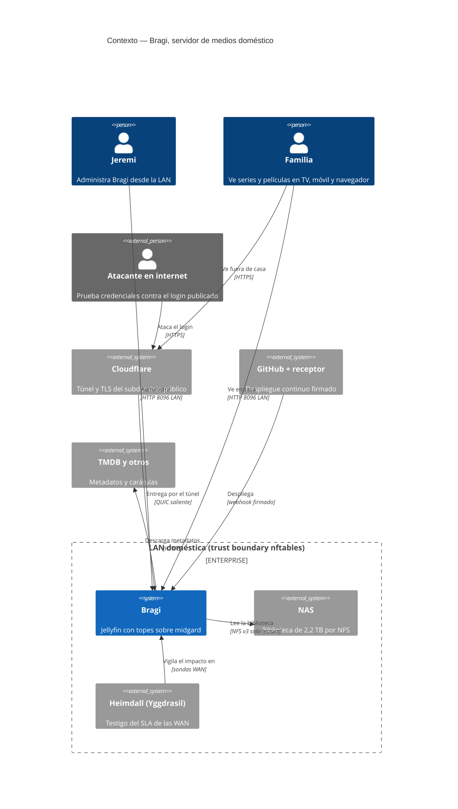
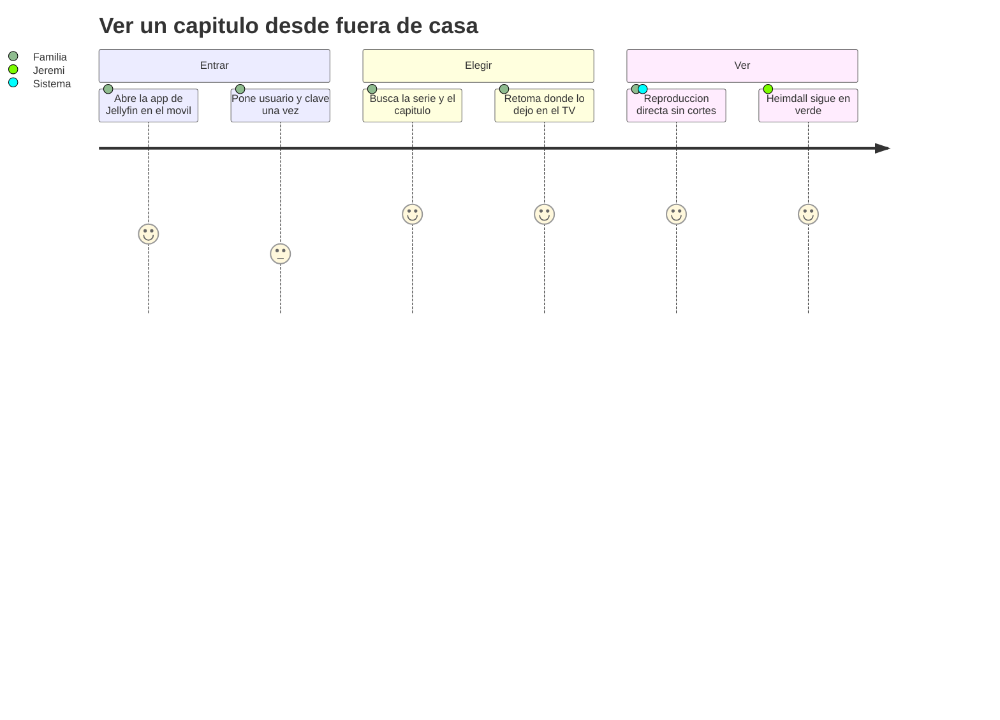
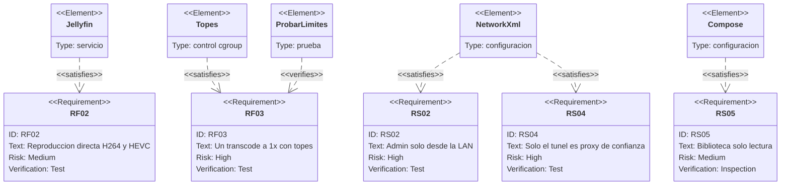
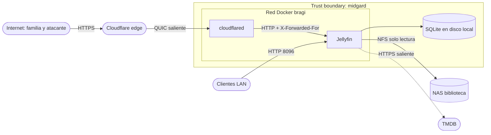
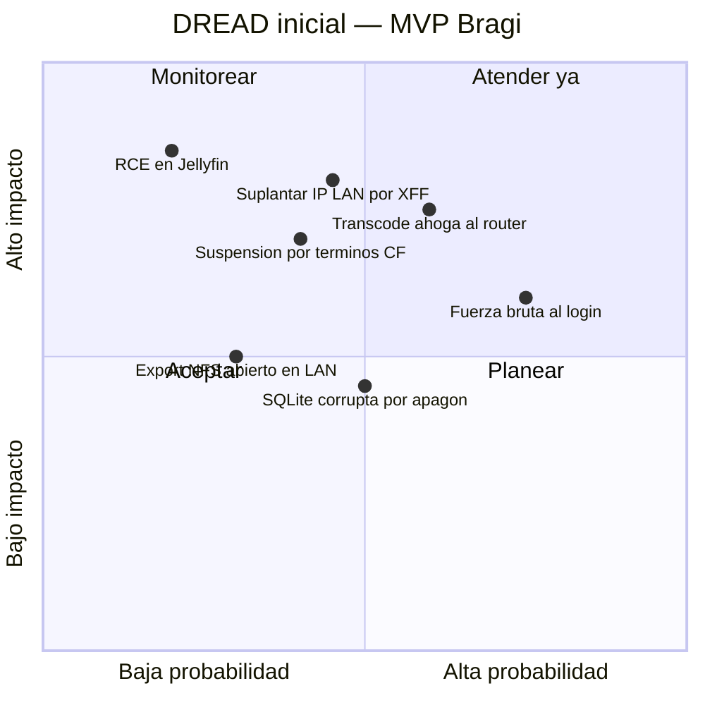

# PRD — MVP de streaming doméstico (Bragi)

* **Estado:** approved (Gate 0, 2026-09-17)
* **Fecha:** 2026-09-17
* **Decisores:** Jeremi
* **Fase AI-DLC:** 01-requirements
* **Versión:** 0.1.1
* **Gate:** 0
* **Feature ID:** BRG-001
* **ASVS:** L1 (V2 autenticación, V3 sesiones, V4 control de acceso, V9 comunicaciones, V14 configuración)

## Problema
La biblioteca (2,2 TB) está en el NAS y no hay forma cómoda de verla desde el TV o el móvil,
y menos fuera de casa. El único servidor disponible es el router de la casa, que no puede
permitirse otro episodio como el de Frigate (45,7 % de CPU media, retirado el 2026-09-11).

## Objetivos
1. Ver cualquier título de la biblioteca en TV, móvil y navegador, en casa y fuera.
2. Una cuenta por persona, con el administrador separado de las cuentas de uso.
3. El streaming nunca degrada el enrutamiento: medible con Heimdall.
4. Despliegue reproducible desde el repo, con rollback.

## No-objetivos
Ver el no-scope del [charter](../00-project/charter.md): adquisición de contenido, más de un
transcode, HEVC por hardware, DLNA, plugins de terceros y Live TV.

## Requisitos funcionales
| ID | Requisito | Verificación |
|---|---|---|
| RF01 | La biblioteca del NAS aparece en Jellyfin, separada en Películas y Series | Prueba: escaneo completo y recuento contra el NAS |
| RF02 | Reproducción directa de H.264 8 bit y HEVC 10 bit en clientes que los soportan | Prueba: panel de actividad muestra "Direct Play" |
| RF03 | Un transcode HEVC 10 bit → H.264 1080p sostenido a ≥ 1,0x con los topes puestos | `probar-limites.sh`: speed ≥ 1,0 |
| RF04 | Acceso externo por HTTPS a un subdominio propio, sin puertos abiertos en las WAN | Prueba desde datos móviles |
| RF05 | Despliegue automático al fusionar en `main`, con rollback si el health falla | Prueba: despliegue con health roto a propósito |

## Requisitos no funcionales
| ID | Requisito |
|---|---|
| RNF01 | Bragi no pasa de 3 hilos de 4 ni de 2 GiB de RAM (tope de cgroup, no buena voluntad) |
| RNF02 | Durante un transcode, las sondas de Heimdall no registran pérdida atribuible a CPU |
| RNF03 | Arranca solo tras un apagón (midgard no tiene UPS) |
| RNF04 | ~~Como máximo 2 sesiones de reproducción simultáneas por cuenta familiar~~ **Sin límite de sesiones por cuenta** (revisado por HITL el 2026-09-17, hallazgo H2): el límite de Jellyfin cuenta dispositivos con sesión, no reproducciones, y la protección del router ya la dan los topes de RNF01 |

## Requisitos de seguridad (ASVS L1)
| ID | Requisito | ASVS | OWASP Top 10:2025 |
|---|---|---|---|
| RS01 | Puerto 8096 atado solo a la IP LAN; nunca a `0.0.0.0` ni a una WAN | V14.4 | A02 |
| RS02 | La cuenta admin no puede autenticarse desde fuera de la LAN | V4.1 | A01 |
| RS03 | Bloqueo de cuenta tras intentos fallidos y límite de tasa del login en Cloudflare | V2.2 | A07 |
| RS04 | Jellyfin solo confía en `X-Forwarded-For` del contenedor del túnel (KnownProxies); la red Docker **no** cuenta como LAN | V14.5 | A01, A05 |
| RS05 | La biblioteca se monta solo lectura: un Bragi comprometido no borra ni cifra la biblioteca | V4.1 | A01 |
| RS06 | Imágenes pineadas por digest; sin `latest` | V14.2 | A03, A08 |
| RS07 | Ningún secreto ni dato de la instalación en el repo | V14.1 | A02 |
| RS08 | Contenedor sin root, sin capacidades y con `no-new-privileges` | V14.2 | A02 |
| RS09 | Contraseñas de ≥ 12 caracteres en todas las cuentas; alta solo por el admin, sin autorregistro | V2.1 | A07 |

## Escenarios de abuso
| ID | Escenario | Control |
|---|---|---|
| AB01 | Un bot en internet prueba contraseñas contra `/Users/AuthenticateByName` a través del túnel | RS03, RS09 |
| AB02 | Con credenciales de un familiar, alguien intenta entrar al panel de administración | RS02, perfil sin privilegios |
| AB03 | Un atacante manda `X-Forwarded-For: 192.0.2.50` para parecer de la LAN y saltarse RS02 | RS04 |
| AB04 | Un usuario remoto con límite de bitrate fuerza transcodes y se come la CPU del router | Tope RNF01, bitrate remoto sin límite bajo |
| AB05 | Una vulnerabilidad de Jellyfin da ejecución en el contenedor e intenta tocar la biblioteca o el host | RS05, RS08, red propia |
| AB06 | Tráfico de vídeo por el CDN gratuito de Cloudflare dispara la suspensión por sus términos | Decisión HITL en ADR-0004 |
| AB07 | Un equipo cualquiera de la LAN monta el export NFS de la biblioteca | Export restringido a la IP del appliance en el NAS (T7) |

## Contexto

*Eje estructura · fase 01 · Gate 0.*

## Recorrido del usuario

*Eje trazabilidad · fase 01 · Gate 0.*

## Trazabilidad

*Eje trazabilidad · fase 01 · Gate 0.*

## Threat assessment inicial

*Eje comportamiento · DFD inicial · Gate 0. Tres fronteras: internet↔Cloudflare,
Cloudflare↔midgard (túnel saliente) y midgard↔NAS.*

*Eje trazabilidad · DREAD · Gate 0. El análisis completo, con STRIDE, está en
[threat-model.md](../02-design/threat-model.md).*
