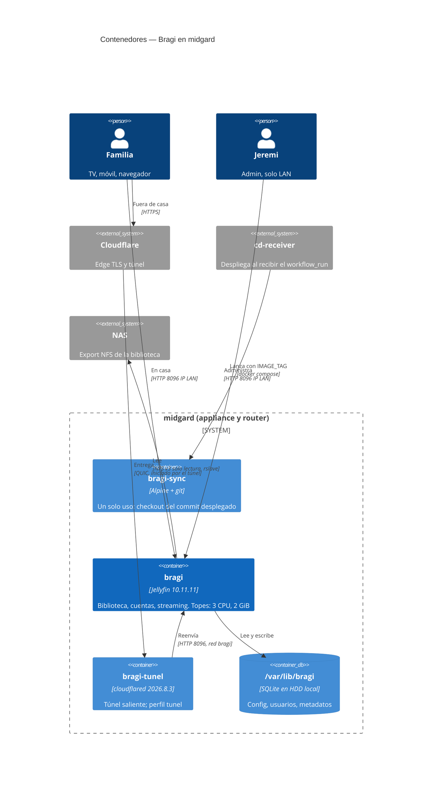
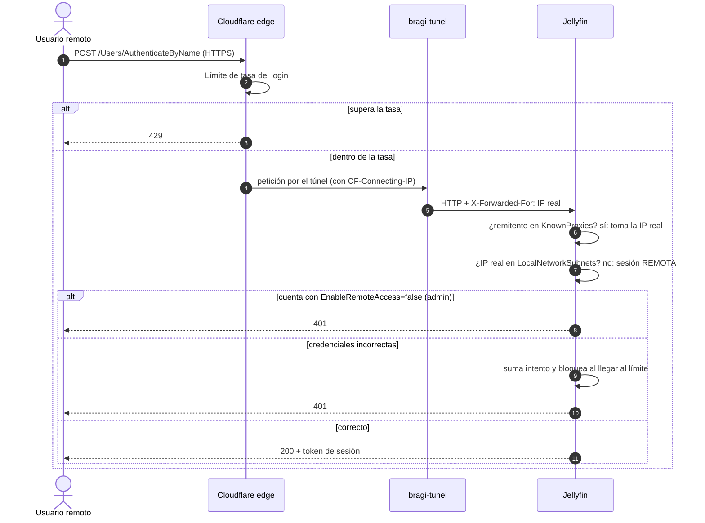
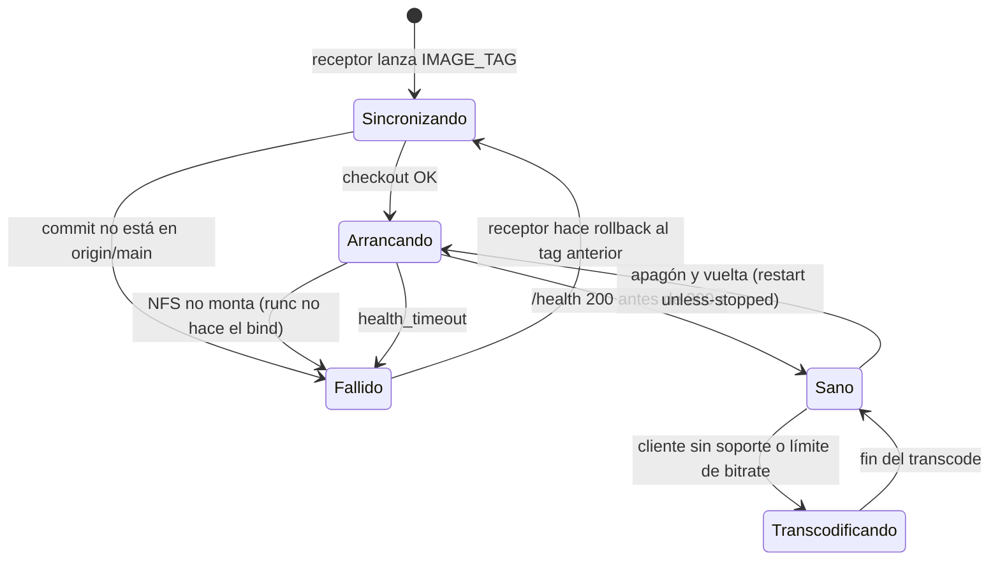

# Arquitectura — Bragi

* **Estado:** review
* **Fecha:** 2026-09-17
* **Decisores:** Jeremi
* **Fase AI-DLC:** 02-design
* **Versión:** 0.1.0
* **Gate:** 1

Bragi no tiene código de dominio propio: es **configuración y operación** de un producto
existente (Jellyfin). Por eso no hay capas Clean/DDD, `erDiagram` ni `classDiagram`: el modelo
de datos es el de Jellyfin y no lo tocamos. Lo que sí se diseña es el despliegue, las fronteras
de confianza y los topes.

## Contenedores

*Eje estructura · fase 02 · Gate 1.*

## Flujo crítico: login remoto y protección del admin

*Eje comportamiento · fase 02 · Gate 1. Si `X-Forwarded-For` llega de una IP que no está en
KnownProxies, Jellyfin usa la IP del socket y la cabecera se ignora (AB03).*

## Ciclo de vida del servicio

*Eje comportamiento · fase 02 · Gate 1.*

## Despliegue
1. Push a `main` → workflow `build` publica `bragi-sync:sha-<7>`.
2. El `workflow_run` firmado llega al receptor por `deploy.<dominio>`.
3. Receptor: `docker compose -p bragi pull` + `up -d` con `IMAGE_TAG`. `sync` hace el checkout;
   Jellyfin arranca cuando `sync` termina bien.
4. Health `http://<IP LAN>:8096/health`; si falla, rollback al tag anterior.

Bootstrap único en el servidor (runbook de Gate 4): clon en `/srv/apps/bragi` (deploy:deploy
750), `deploy/.env` 0600, `/var/lib/bragi/{config,cache}` del `PUID`, migración de la config
actual desde `~/jellyfin`, entrada en `apps.yml` y recarga del receptor.
