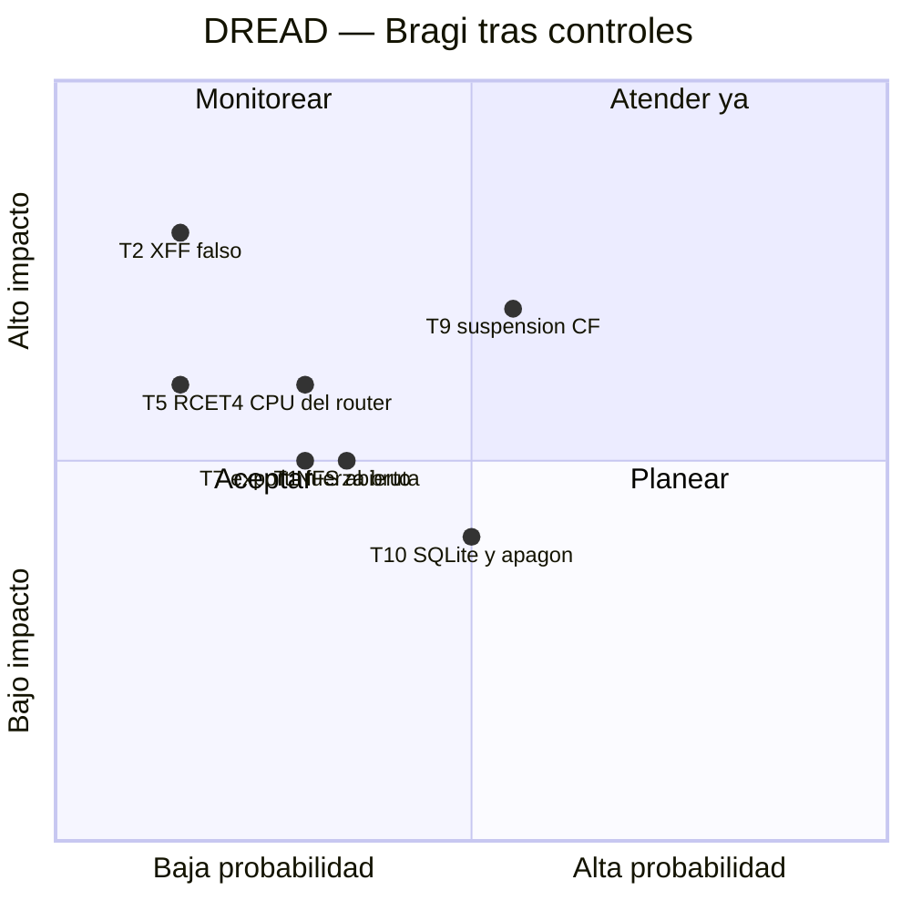

# Threat model — Bragi

* **Estado:** review
* **Fecha:** 2026-09-17
* **Decisores:** Jeremi
* **Fase AI-DLC:** 02-design
* **Versión:** 0.1.0
* **Alcance:** Jellyfin, túnel, tarea sync, montaje NFS y datos en midgard
* **Metodología:** STRIDE por elemento del DFD + DREAD para priorizar

## DFD

*Eje comportamiento · DFD STRIDE · Gate 1. TB1 = internet↔Cloudflare; TB2 = el túnel entra en
midgard; TB3 = red Docker; TB4 = midgard↔NAS.*

## STRIDE
| ID | Elemento | STRIDE | Amenaza | Control | Traza |
|---|---|---|---|---|---|
| T1 | Flujo 1/3 | S | Fuerza bruta de contraseñas por el túnel | Límite de tasa CF + bloqueo por intentos + contraseñas ≥ 12 | RS03, RS09 |
| T2 | Flujo 3 | S, E | `X-Forwarded-For` falso para parecer LAN y usar el admin | KnownProxies = solo IP del túnel; la red Docker fuera de `LocalNetworkSubnets` | RS04, ADR-0004 |
| T3 | Jellyfin | E | Familiar intenta funciones de admin | Cuentas sin privilegios; admin sin acceso remoto | RS02 |
| T4 | Jellyfin | D | Transcodes que ahogan al router | `cpus 3.0`, `cpu_shares 512`, 2 sesiones por cuenta | RNF01, RNF04, ADR-0002 |
| T5 | Jellyfin | E, T | RCE en Jellyfin toca biblioteca o host | Sin root, `cap_drop ALL`, `no-new-privileges`, biblioteca `ro` | RS05, RS08 |
| T6 | Imágenes | T | Imagen alterada o `latest` que cambia solo | Digest pineado; sync sobre Alpine pineado | RS06, ADR-0001 |
| T7 | Flujo 6 | I, T | El NAS exporta a `*`: cualquier equipo LAN monta la biblioteca | **Fuera de Bragi**: restringir el export a la IP del appliance | AB07 |
| T8 | Flujo 5 | I | Credenciales en HTTP dentro de la LAN | Aceptado (LAN de confianza, como Odín); revisable si se añade TLS local | data-classification |
| T9 | Flujo 1 | D | Cloudflare limita la zona por servir vídeo | Zona aparte (ADR-0004, HITL) | AB06 |
| T10 | DB | D | Apagón corrompe SQLite (sin UPS) | Respaldo de `/var/lib/bragi/config` antes de upgrades y periódico (Gate 4) | ADR-0001 |
| T11 | Flujo 7/8 | T | Un commit malicioso en `main` se despliega solo | Ruleset Protect-MAIN (PR obligatorio); sync solo hace checkout, no ejecuta | ADR-0003 |
| T12 | `.env` | I | `TUNNEL_TOKEN` filtrado permite suplantar el túnel | `.env` 0600, fuera del repo; rotación en el panel de CF | RS07 |

## DREAD

*Eje trazabilidad · DREAD residual · Gate 1. T9 queda en "atender ya" hasta decidir ADR-0004.*

## Verificación prevista (Gate 3)
| Amenaza | Prueba |
|---|---|
| T2 | Desde fuera, `curl -H 'X-Forwarded-For: <IP LAN>'` contra el login admin → 401 |
| T3 | Cuenta familiar contra `/System/Configuration` → 403 |
| T4 | `probar-limites.sh` con transcode + Heimdall sin alertas |
| T5 | `docker inspect bragi`: `User` ≠ 0, `CapDrop=[ALL]`; `touch /media/x` → solo lectura |
| T1 | 10 intentos fallidos → bloqueo de la cuenta y 429 de Cloudflare |
