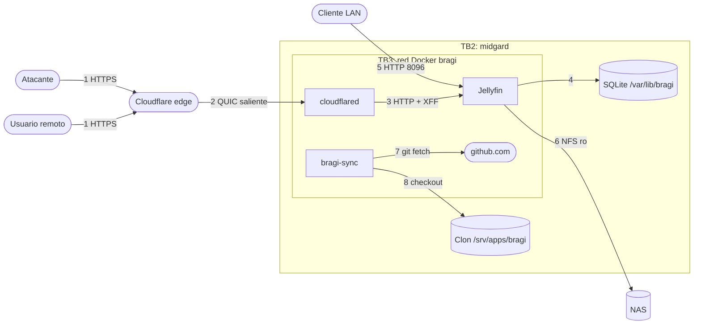
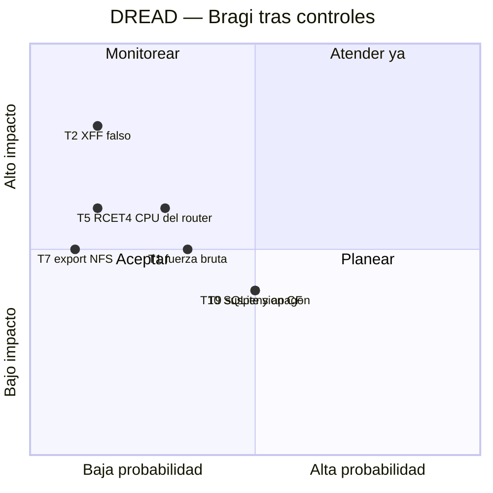

# Threat model — Bragi

* **Estado:** approved (Gate 1, 2026-09-17)
* **Fecha:** 2026-09-17
* **Decisores:** Jeremi
* **Fase AI-DLC:** 02-design
* **Versión:** 0.3.0
* **Alcance:** Jellyfin, túnel, tarea sync, montaje NFS y datos en midgard
* **Metodología:** STRIDE por elemento del DFD + DREAD para priorizar

## DFD

*Eje comportamiento · DFD STRIDE · Gate 1. TB1 = internet↔Cloudflare; TB2 = el túnel entra en
midgard; TB3 = red Docker; TB4 = midgard↔NAS.*

## STRIDE
| ID | Elemento | STRIDE | Amenaza | Control | Traza |
|---|---|---|---|---|---|
| T1 | Flujo 1/3 | S | Fuerza bruta de contraseñas por el túnel | Límite de tasa CF + contraseñas ≥ 12. El bloqueo por intentos **no funciona en 10.11.11** (H1) | RS03, RS09 |
| T2 | Flujo 3 | S, E | `X-Forwarded-For` falso para parecer LAN y usar el admin | KnownProxies = solo IP del túnel; la red Docker fuera de `LocalNetworkSubnets` | RS04, ADR-0004 |
| T3 | Jellyfin | E | Familiar intenta funciones de admin | Cuentas sin privilegios; admin sin acceso remoto | RS02 |
| T4 | Jellyfin | D | Transcodes que ahogan al router | `cpus 3.0`, `cpu_shares 512`, sin límite de bitrate remoto | RNF01, RNF04, ADR-0002 |
| T5 | Jellyfin | E, T | RCE en Jellyfin toca biblioteca o host | Sin root, `cap_drop ALL`, `no-new-privileges`, biblioteca `ro` | RS05, RS08 |
| T6 | Imágenes | T | Imagen alterada o `latest` que cambia solo | Digest pineado; sync sobre Alpine pineado | RS06, ADR-0001 |
| T7 | Flujo 6 | I, T | El NAS exportaba a `*`: cualquier equipo LAN montaba la biblioteca | Export restringido a la IP del appliance (2026-09-17, verificado); `verificar-media.sh` avisa si vuelve a `*` | AB07 |
| T8 | Flujo 5 | I | Credenciales en HTTP dentro de la LAN | Aceptado (LAN de confianza, como Odín); revisable si se añade TLS local | data-classification |
| T9 | Flujo 1 | D | Cloudflare limita la zona por servir vídeo | Zona aparte de `higerotech.com` (ADR-0004); residual: misma cuenta | AB06 |
| T10 | DB | D | Apagón corrompe SQLite (sin UPS) | Respaldo de `/var/lib/bragi/config` antes de upgrades y periódico (Gate 4) | ADR-0001 |
| T11 | Flujo 7/8 | T | Un commit malicioso en `main` se despliega solo | Ruleset Protect-MAIN (PR obligatorio); sync solo hace checkout, no ejecuta | ADR-0003 |
| T12 | `.env` | I | `TUNNEL_TOKEN` filtrado permite suplantar el túnel | `.env` 0600, fuera del repo; rotación en el panel de CF | RS07 |

## DREAD

*Eje trazabilidad · DREAD residual · Gate 1. Con la zona aparte, T9 baja de impacto: una
limitación ya no alcanza la landing ni el despliegue continuo.*

## Hallazgos de implementación (Gate 2)
Salen de `deploy/tests/prueba-proxy.sh`, que ataca la frontera con un Jellyfin 10.11.11 real.

| ID | Hallazgo | Impacto | Estado |
|---|---|---|---|
| H1 | **El bloqueo por intentos no bloquea.** Jellyfin registra `Disabling user ... due to 5 unsuccessful login attempts`, pero no guarda `IsDisabled` y la clave buena sigue entrando. Es [jellyfin#17278](https://github.com/jellyfin/jellyfin/issues/17278), arreglado en 12.0 por el PR #17274 y sin backport a 10.11 | RS03 queda sin su segundo control: frente a T1 solo quedan el límite de tasa de Cloudflare y la longitud de la clave | **Decidido (HITL 2026-09-17):** se acepta mientras Bragi sea solo LAN, donde T1 no aplica. La versión se decide **antes de activar el perfil `tunel`** (Gate 4), con #18100 ya triado. P9 sigue como fallo conocido |
| H2 | **`MaxActiveSessions` cuenta sesiones abiertas, no reproducciones.** Con 2, el tercer dispositivo con la sesión iniciada recibe 403 al entrar | RNF04 tal como está escrito no se puede implementar así, y con 2 una persona con TV, móvil y tablet se queda fuera | **Decidido (HITL 2026-09-17):** RNF04 revisado, sin límite (`MaxActiveSessions=0`). Los topes de CPU protegen el router sea cual sea el número de reproducciones |
| H3 | Con `X-Forwarded-For: <IP LAN>, <IP pública>` llegando del proxy, Jellyfin usa la de la derecha | Confirma que el XFF falsificado a través de Cloudflare no salta RS02 (P5) | Resuelto, con prueba |

Estado de la versión (consultado el 2026-09-17): 12.0 arregla H1, pero `/UserViews` agota la
memoria en bibliotecas grandes ([#17871](https://github.com/jellyfin/jellyfin/issues/17871),
arreglado en 12.1). 12.1 tiene abierto un informe de corrupción de `jellyfin.db`
([#18100](https://github.com/jellyfin/jellyfin/issues/18100)), delicado en un equipo sin UPS.

## Verificación prevista (Gate 3)
| Amenaza | Prueba |
|---|---|
| T2 | Cubierto en CI por P2–P6. En el appliance: desde datos móviles, admin → 403 |
| T3 | Cuenta familiar contra `/System/Configuration` → 403 |
| T4 | `probar-limites.sh` con transcode + Heimdall sin alertas |
| T5 | `docker inspect bragi`: `User` ≠ 0, `CapDrop=[ALL]`; `touch /media/x` → solo lectura |
| T7 | Montar el export desde un equipo LAN que no sea el appliance → `access denied` (hecho el 2026-09-17) |
| T1 | Ráfaga contra el login → 429 de Cloudflare. El bloqueo de cuenta depende de H1 |
