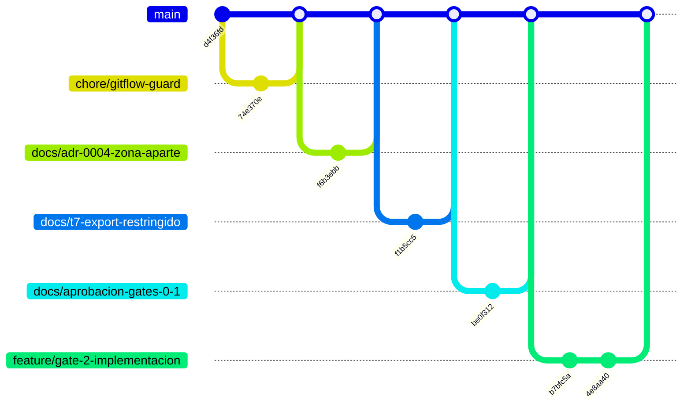

# Historial del repositorio — Bragi

* **Estado:** approved (Gate 2, 2026-09-17)
* **Fecha:** 2026-09-17
* **Decisores:** Jeremi
* **Fase AI-DLC:** 03-implementation
* **Versión:** 0.3.0

> Derivado con `gitgraph_from_log.py . --branch develop`. El script llama `main` a la rama
> troncal: en este grafo es **`develop`** (GitFlow). Aún no hay tags: `v0.1.0`–`v0.3.0` se ponen
> en `main` con la primera release, y entonces esta tabla enlaza tag ↔ versión ↔ gate.

| Tag | Versión | Gate | Evidencia principal |
|---|---|---|---|
| `v0.1.0` (pendiente) | 0.1.0 | Gate 0 | PRD `mvp-streaming`, charter |
| `v0.2.0` (pendiente) | 0.2.0 | Gate 1 | ADR-0001..0005, threat model, T7 |
| `v0.3.0` (pendiente) | 0.3.0 | Gate 2 | ADR-0006, `prueba-proxy.sh`, CI (#5) |

## Documentación viva

Derivado de `git log` con `scripts/gitgraph_from_log.py`. Regenerar tras cada merge o tag para
mantener la traza sincronizada. Los tags SemVer enlazan con las versiones del `CHANGELOG.md`.

### Grafo de commits y merges

### Bitácora de cambios (fiel al repo)

| Commit | Tipo | Tags | Autor | Fecha | Mensaje |
|---|---|---|---|---|---|
| `7251221` | merge | — | Jeremi J. Alcalá M. | 2026-09-17 | Merge pull request #5 from higerotech/feature/gate-2-implementacion |
| `15a2871` | merge | — | Jeremi J. Alcalá M. | 2026-09-17 | Merge pull request #4 from higerotech/docs/aprobacion-gates-0-1 |
| `309e0fd` | merge | — | Jeremi J. Alcalá M. | 2026-09-17 | Merge pull request #3 from higerotech/docs/t7-export-restringido |
| `4e8aa40` | commit | — | Jeremi Alcala | 2026-09-17 | sec: bragi-sync sin root por defecto (Trivy DS-0002) |
| `b7bfc5a` | commit | — | Jeremi Alcala | 2026-09-17 | feat: network.xml como codigo, politicas de cuenta y CI con prueba de integracion |
| `be0f312` | commit | — | Jeremi Alcala | 2026-09-17 | gates: aprueba Gate 0 y Gate 1, corta 0.1.0 y 0.2.0 |
| `f1b5cc5` | commit | — | Jeremi Alcala | 2026-09-17 | sec: cierra T7, export NFS de media restringido al appliance |
| `5008fdd` | merge | — | Jeremi J. Alcalá M. | 2026-09-17 | Merge pull request #2 from higerotech/docs/adr-0004-zona-aparte |
| `b5d0236` | merge | — | Jeremi J. Alcalá M. | 2026-09-17 | Merge pull request #1 from higerotech/chore/gitflow-guard |
| `f6b3ebb` | commit | — | Jeremi Alcala | 2026-09-17 | docs: acepta ADR-0004 con el tunel en una zona aparte |
| `74e370e` | commit | — | Jeremi Alcala | 2026-09-17 | chore: guardia de GitFlow hacia main |
| `d4f36fd` | commit | — | Jeremi Alcala | 2026-09-17 | docs: arranque de Bragi, servidor de medios Jellyfin en midgard |
