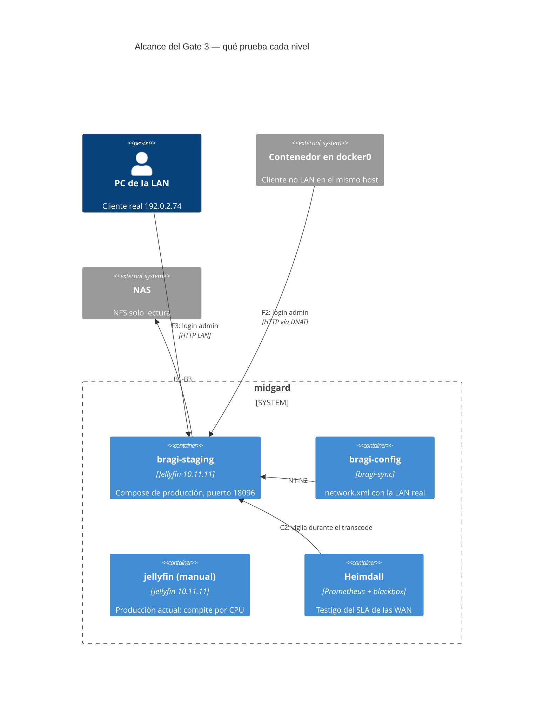

# Plan y evidencia de pruebas — Bragi

* **Estado:** review
* **Fecha:** 2026-09-17
* **Decisores:** Jeremi
* **Fase AI-DLC:** 04-testing
* **Versión:** 0.4.0-dev
* **Gate:** 3

Dos niveles de prueba, con los mismos artefactos que producción:

| Nivel | Dónde | Herramienta | Qué aporta |
|---|---|---|---|
| Integración | CI, contenedores aislados | `deploy/tests/prueba-proxy.sh` | La frontera de confianza atacada desde tres posiciones, en cada PR |
| Appliance | midgard, staging junto a producción | `deploy/tests/prueba-appliance.sh` + `probar-limites.sh` | Red, NFS, Docker y CPU **reales** |

El staging se levanta con `deploy/docker-compose.yml` + `deploy/tests/docker-compose.staging.yml`:
el mismo compose de producción, con la imagen `bragi-sync` construida en local, `sync` sin checkout,
puerto 18096, base propia y cuentas de prueba propias. Staging del 2026-09-17 sobre el commit
`82594f0`.

## Alcance de las pruebas

*Eje estructura · C4 anotado con el alcance · Gate 3.*

## Resultados en el appliance (2026-09-17)

| ID | Prueba | Requisito | Resultado |
|---|---|---|---|
| A1 | Contenedor sano tras `up` (≈15 s) | RNF03 | ✅ |
| A2 | 8096 publicado solo en la IP LAN | RS01 | ✅ |
| A3–A5 | Sin root, `cap_drop ALL`, `no-new-privileges` | RS08 | ✅ |
| A6 | Imagen por digest | RS06 | ✅ |
| A7–A9 | Topes efectivos: 3 CPU, 2 GiB, `cpu_shares` 512 | RNF01 | ✅ |
| B1 | `/media` con propagación `rslave` | ADR-0005 | ✅ |
| B2 | `/media` de solo lectura | RS05 | ✅ |
| B3 | La biblioteca se ve dentro del contenedor | RF01 | ✅ |
| N1–N2 | `network.xml`: LAN real y solo el proxy del túnel | RS04, ADR-0006 | ✅ |
| F1 | Admin desde el host (IP LAN) | RS02 | ✅ 200 |
| F2 | Admin desde un contenedor en `docker0` | RS02, RS04 | ✅ 403 |
| **F3** | **Admin desde un PC real de la LAN** | RS02 | ✅ 200: Docker conserva la IP del cliente en el puerto publicado. Con la IP del gateway habría sido 403 |
| P1 | `politicas.sh --verificar` sin deriva | RS02, RS03 | ✅ |
| C1 | Transcode HEVC 10 bit → H.264 1080p con `cpus: 3.0`, con el escaneo de producción en marcha | RF03 | ❌ 0,78x |
| C1b | Ídem **sin contención** (Jellyfin de producción pausado 82 s con autorización de Jeremi, sin clientes conectados) | RF03 | ❌ **0,92x** |
| C1c | Preset **`superfast`**, `cpus: 3.0`, sin contención (segunda pausa autorizada, 124 s) | RF03 | ✅ **1,13x** |
| C1d | Comparación: preset `veryfast`, `cpus: 4.0`, sin contención | RF03 | ✅ 1,11x |
| C2b | Heimdall durante C1c y C1d | RNF02 | ✅ 0 alertas; las 9 sondas con mínimo 1 en 5 min |
| C2 | Heimdall durante el transcode | RNF02 | ✅ 0 alertas; todas las sondas en 1 |

## Hallazgos del Gate 3

| ID | Hallazgo | Estado |
|---|---|---|
| H4 | **No probado aún: arranque tras un apagón.** Yggdrasil descubrió (su TA-13) que Docker no reaplica `restart: unless-stopped` a un contenedor que falla durante la restauración tras un apagado sucio. Bragi tiene un motivo extra para fallar ahí: si el automount NFS no está listo, runc no puede hacer el bind de `/media` y el contenedor no arranca | Gate 4: unidad de arranque equivalente a `yggdrasil-arranque.service` y prueba de reinicio con HITL |
| H5 | **RF03 falla bajo contención: 0,78x.** Durante la prueba, el Jellyfin manual de producción estaba en su primer escaneo (≈28 % de CPU sostenida, 16 % de iowait) y un contenedor de otro stack tuvo un pico del 95 %. La carga del host era 2,6 **antes** de empezar. La estimación de diseño (~1,25x) salía de una medida sin contención | **Medido sin contención:** `veryfast` con 3.0 da 0,92x; **`superfast` con 3.0 da 1,13x**, algo mejor incluso que `veryfast` sin tope efectivo (4.0: 1,11x). La estimación de ~1,25x venía de otro fichero. El margen es estrecho (13 %): con un escaneo en marcha no llegaría. Decisión de diseño pendiente (HITL) |

**Lectura de H5 para el diseño, sea cual sea la repetición:** mientras Jellyfin escanea, un
transcode no llega a tiempo real con el tope actual. El escaneo inicial es puntual, pero los
escaneos programados y la extracción de imágenes de capítulos vuelven con cada lote de contenido
nuevo. Es un motivo más para empujar a la reproducción directa (ADR-0002), y el tope hizo lo que
debía: el router no se enteró (C2).

## Pendiente para cerrar el Gate 3
- [x] Repetir C1 sin contención (H5): 0,92x.
- [x] Medir alternativas sin contención: `superfast` a 3.0 = 1,13x; `veryfast` a 4.0 = 1,11x.
- [ ] **HITL:** decidir cómo se cumple RF03. Recomendación: `superfast` manteniendo el tope de 3.0.
- [ ] Ejecutar el CI sobre esta rama.
