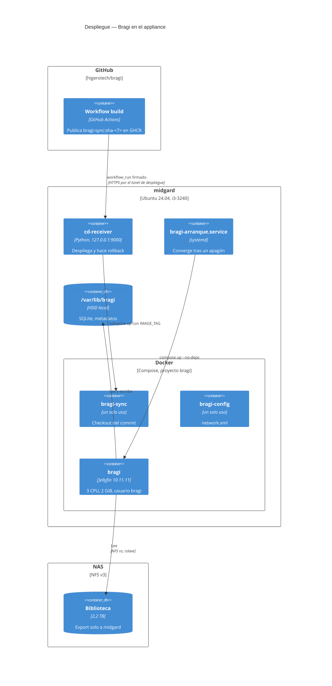
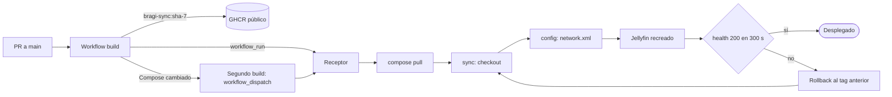

# Despliegue — Bragi

* **Estado:** approved (Gate 4, 2026-09-18)
* **Fecha:** 2026-09-18
* **Decisores:** Jeremi
* **Fase AI-DLC:** 05-deployment
* **Versión:** 0.5.0
* **Gate:** 4

Runbook para pasar del Jellyfin manual (`~/jellyfin`) a Bragi desplegado por el receptor de
`despliegue-continuo`. Los pasos marcados **[Jeremi]** necesitan una cuenta o una decisión que
solo tiene el owner.

## Topología


*Eje estructura · C4 Deployment · Gate 4.*

## Pipeline y rollback


*Eje comportamiento · pipeline con rollback · Gate 4. El rollback restaura imagen y ficheros,
**no la base de datos** (ADR-0001).*

## Plan de corte

```mermaid
gantt
    title Corte del Jellyfin manual a Bragi
    dateFormat HH:mm
    axisFormat %H:%M
    section Preparación sin corte
    Release a main y build             :a1, 00:00, 10m
    GHCR bragi-sync a público [Jeremi] :a2, after a1, 5m
    Desmontar staging del Gate 3       :a3, after a1, 5m
    bootstrap-midgard.sh               :a4, after a3, 10m
    Webhook de GitHub [Jeremi]         :a5, after a4, 5m
    section Ventana de corte
    migrar-desde-manual.sh             :crit, b1, after a5, 10m
    Primer despliegue por el receptor  :crit, b2, after b1, 10m
    prueba-appliance.sh y politicas.sh :b3, after b2, 10m
    section Después
    Prueba de reinicio H4 [Jeremi]     :c1, after b3, 15m
```


*Eje trazabilidad · gantt del corte · Gate 4. El servicio solo se interrumpe en la sección
crítica (unos 20 min, casi todo el primer arranque sobre el HDD).*

## Pasos

### 0. Prerrequisitos
- `verificar-media.sh` pasa: el NAS exporta la biblioteca solo a midgard y monta.
- Nadie está viendo nada durante la ventana de corte.

### 1. Release a `main`
Rama `release/<versión>` desde `develop`, PR a `main` y merge. El workflow `build` publica
`ghcr.io/higerotech/bragi-sync:sha-<7>`. Todavía no despliega nada, porque el receptor aún no conoce
Bragi o no hay webhook.

### 2. **[Jeremi]** Paquete GHCR público
El receptor hace pull anónimo. Los paquetes nuevos de la organización nacen privados: en GitHub,
**Packages → bragi-sync → Package settings → Change visibility → Public**. Comprobación:

```bash
curl -s "https://ghcr.io/token?scope=repository:higerotech/bragi-sync:pull" | jq -r .token | head -c 10
```

### 3. Desmontar el staging del Gate 3
Usa los nombres `bragi-sync`, `bragi-config` y la red `bragi` de producción.

```bash
cd ~/bragi-staging/repo
docker compose -p bragi-staging -f deploy/docker-compose.yml -f deploy/tests/docker-compose.staging.yml \
  --env-file ../staging.env down
docker image rm bragi-sync:staging
rm -rf ~/bragi-staging
```

### 4. Bootstrap del appliance

```bash
sudo BRANCH=main TZ_HOGAR=<zona de la casa> bash /ruta/al/clon/deploy/cd/bootstrap-midgard.sh
```

Crea el usuario `bragi` (ADR-0007), `/var/lib/bragi`, el clon en `/srv/apps/bragi`,
`deploy/.env` (0600) con la LAN real, la entrada en `apps.yml` y la unidad `bragi-arranque`.

### 5. **[Jeremi]** Webhook de GitHub
Mismo receptor y mismo secreto que Yggdrasil. Desde tu equipo, sin que el secreto toque el disco:

```bash
SECRET=$(ssh -t <usuario>@<midgard> "sudo grep -oP 'WEBHOOK_SECRET=\K.*' /etc/cd-receiver/receiver.env" | tr -d '\r\n')
gh api repos/higerotech/bragi/hooks -f name=web -F active=true -f 'events[]=workflow_run' \
  -f config[url]=https://deploy.<dominio>/webhook \
  -f config[content_type]=json -f config[secret]="$SECRET"
unset SECRET
```

### 6. Ventana de corte (interrumpe el servicio)

```bash
sudo ORIGEN=/home/<usuario>/jellyfin bash /srv/apps/bragi/deploy/cd/migrar-desde-manual.sh
gh workflow run build.yml -R higerotech/bragi --ref main    # primer despliegue por el receptor
```

El receptor despliega el SHA de `main`. El primer arranque sobre el HDD puede tardar ~3 min.

### 7. Verificación

Con `sudo`: el clon es `750 deploy:deploy` y `deploy` no está en el grupo `docker` (el receptor
habla con Docker por un socket-proxy).

```bash
sudo env JELLYFIN_URL=http://<ip-lan>:8096 JELLYFIN_TOKEN=<api key> \
  bash /srv/apps/bragi/deploy/scripts/politicas.sh --aplicar
sudo env BRAGI_CONTENEDOR=bragi HOST_LAN_IP=... LAN_SUBNET=... ADMIN_USUARIO=... ADMIN_CLAVE=... \
  bash /srv/apps/bragi/deploy/tests/prueba-appliance.sh
```

### 8. **[Jeremi]** Prueba de reinicio (H4)
`sudo systemctl reboot` con el owner presente. Criterio: Bragi `healthy` sin intervención y
`journalctl -u bragi-arranque` muestra la espera del NFS y la convergencia.

### 9. Respaldo nocturno (ADR-0008)
Con el share `respaldos` del NAS exportado **solo** al appliance:

```bash
sudo NAS=<ip-del-nas> bash /srv/apps/bragi/deploy/respaldo/instalar.sh
sudo systemctl start bragi-respaldo.service          # primer respaldo
journalctl -u bragi-respaldo -n 5 -o cat              # "integrity_check ok" y "verificado"
```

### Restaurar un respaldo
1. `sha256sum -c` del archivo en `/mnt/nas/respaldos/bragi/`.
2. Parar Bragi: `docker compose -p bragi -f /srv/apps/bragi/deploy/docker-compose.yml stop jellyfin`.
3. Apartar la configuración actual, sin borrarla: `mv /var/lib/bragi/config /var/lib/bragi/config.roto-<fecha>`.
4. `tar -C /var/lib/bragi -xzf <archivo>` y `chown -R bragi: /var/lib/bragi/config`.
5. Arrancar con `bragi-arranque.sh`. Jellyfin vuelve a descargar las carátulas en el siguiente escaneo.

**Simulacro sin tocar producción** (hecho el 2026-09-18): extraer en un directorio temporal y
levantar la misma imagen con `--cpus 1`, `-p 127.0.0.1:18097:8096` y ese directorio como `/config`.
Debe responder en `/System/Info/Public` con el mismo `Id` que producción y
`StartupWizardCompleted: true`.

## Rollback de la migración
Si Bragi no queda sano tras el corte, se vuelve al despliegue manual, que sigue intacto:

```bash
docker compose -p bragi -f /srv/apps/bragi/deploy/docker-compose.yml down
docker update --restart unless-stopped jellyfin && docker start jellyfin
```
