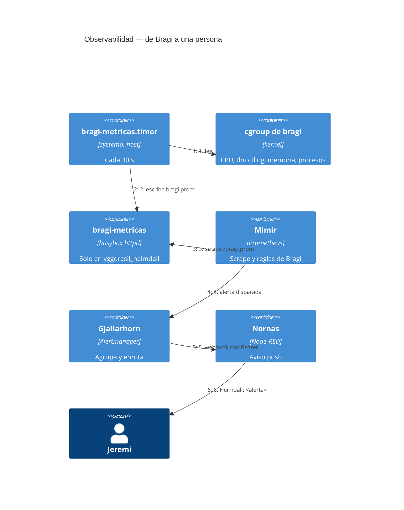
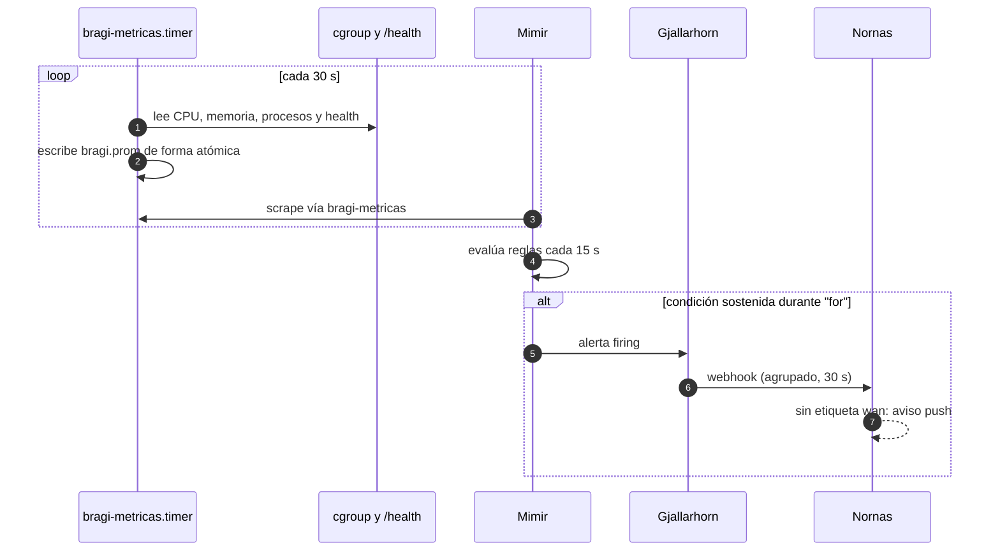
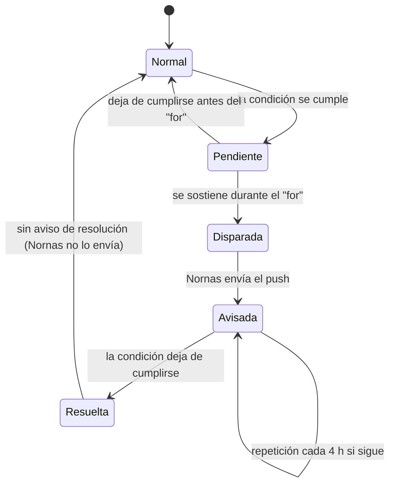
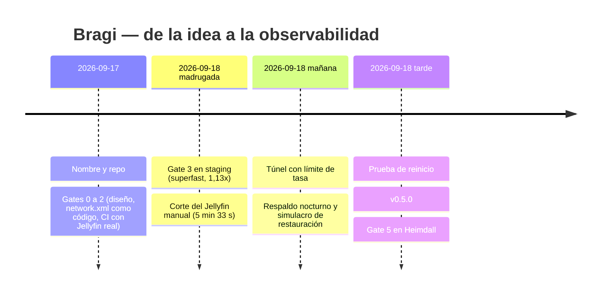

# Observabilidad — Bragi

* **Estado:** review
* **Fecha:** 2026-09-18
* **Decisores:** Jeremi
* **Fase AI-DLC:** 06-monitoring
* **Versión:** 0.6.0-dev
* **Gate:** 5

Bragi no trae su propio stack de observabilidad: se integra en **Heimdall** (Yggdrasil), que ya
corre en el appliance (ADR-0009).

## Qué se vigila

| Pregunta | Métrica | Alerta | Umbral y porqué |
|---|---|---|---|
| ¿Vive en la LAN? | `bragi_up{comprobacion="lan"}` | `BragiCaido` (critical) | 3 min: un despliegue reinicia Jellyfin ~30 s |
| ¿Vive desde fuera? | `bragi_up{comprobacion="externo"}` | `BragiExternoCaido` | 5 min; se calla si la casa no tiene ruta |
| ¿Llegan las métricas? | `up{job="bragi"}`, `bragi_collector_timestamp_seconds` | `BragiSinMetricas` | 3 min: sin ellas ninguna otra alerta salta |
| ¿Hay respaldo? | `bragi_backup_last_success_timestamp_seconds` | `BragiRespaldoAtrasado` | 30 h: diario, con `Persistent=true` |
| ¿Cabe el transcode? | `bragi_transcodes` | `BragiMasDeUnTranscode` | >1: solo cabe uno (ADR-0002) |
| ¿CPU anómala? | `bragi:cpu_uso:ratio_5m` | `BragiCpuAltaSinTranscode` | >80 % del tope 20 min **sin** transcode |
| ¿Memoria? | `bragi_memory_bytes{tipo="anon"}` | `BragiMemoriaAlta` | >85 % de 2 GiB; la caché no cuenta |
| ¿Afecta al router? | `bragi_transcodes` + `ALERTS` de WAN | `BragiTranscodeConWanDegradada` (info) | Correlación para RNF02 |

También se exportan, para paneles: `bragi:cpu_limitado:ratio_5m` (fracción de periodos en el
tope), `bragi_health_seconds`, `bragi_container_running`, `bragi_ffmpeg_processes`,
`bragi_cpu_limit_cores`, `bragi_memory_limit_bytes` y `bragi_backup_last_bytes`.

## Cómo fluye

*Eje comportamiento · C4 Dynamic · Gate 5.*

*Eje comportamiento · secuencia de observabilidad · Gate 5.*

## Ciclo de un incidente

*Eje comportamiento · estado del incidente · Gate 5.*

## Historial

*Eje trazabilidad · timeline · Gate 5.*

## Instalación
1. **Bragi:** `sudo bash /srv/apps/bragi/deploy/metricas/instalar.sh` (recolector, timer y estado
   inicial del respaldo) y añadir `metricas` a `COMPOSE_PROFILES` en `deploy/.env`.
2. **Yggdrasil:** `bragi-job.yml` en `scrape_configs` y `bragi-alertas.yml` en
   `deploy/prometheus/rules/`. Lo despliega su receptor.
3. **Verificación de extremo a extremo:** parar `bragi-metricas` más de 3 min debe producir el
   aviso `Heimdall: BragiSinMetricas`.
